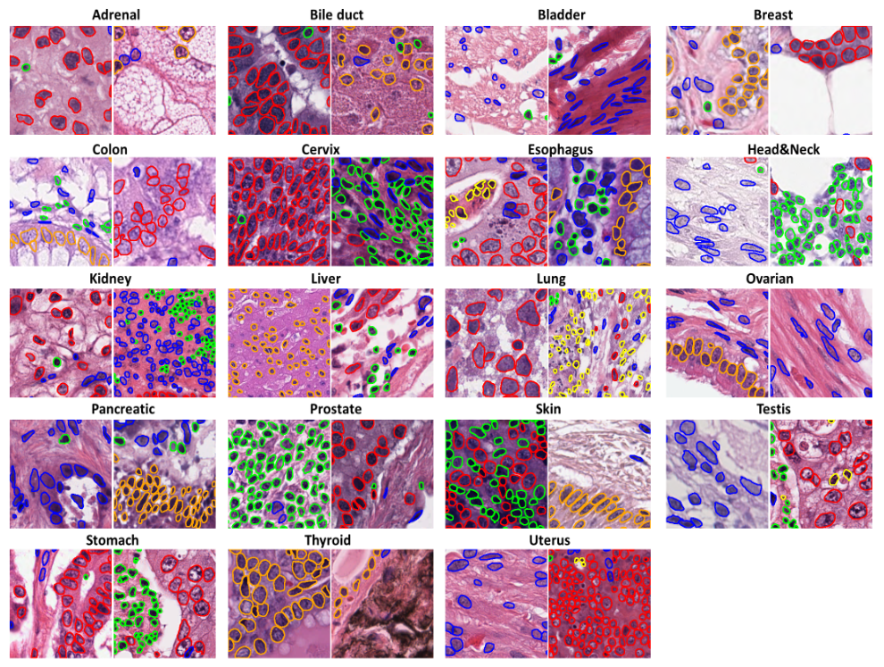
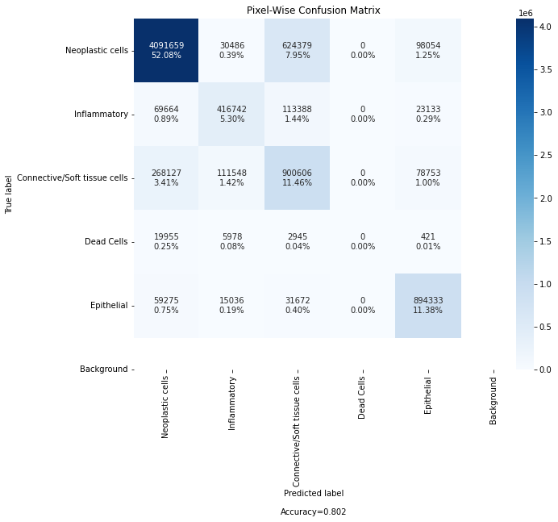
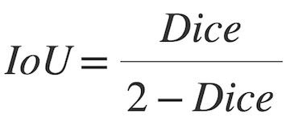

# Cancer Instance Segmentation from Tissue

**YAI 2021 Fall Project - Medical Project Team**

* **[Dongha Kim](https://github.com/kdha0727)** - Yonsei Univ. College of Medicine.

* **[Donggeon Bae](https://github.com/AttiBae)** - Yonsei. Univ. Dept. of Electrical and Electronic Engineering.

* **[Junho Lee](https://github.com/leejunho0421)** - Yonsei Univ. Dept. of Computer Engineering.

---

## Dataset

**Cancer Instance Segmentation and Classification Dataset**

### Data Description

This dataset, also known as PanNuke, contains semi automatically generated nuclei instance segmentation and classification images with exhaustive nuclei labels across 19 different tissue types. The dataset consists of 481 visual fields, of which 312 are randomly sampled from more than 20K whole slide images at different magnifications, from multiple data sources.

In total the dataset contains 205,343 labeled nuclei, each with an instance segmentation mask. Models trained on PanNuke can aid in whole slide image tissue type segmentation, and generalise to new tissues.

19 Tissue types (Breast, Colon, Bile-duct, Esophagus, Uterus, Lung, Cervix, Head&Neck, Skin, Adrenal Gland, Kidney, Stomach, Prostate, Testis, Liver, Thyroid, Pancreas, Ovary, Bladder). Note, that it also unifies existing datasets within it, we have carefully labelled these under a single nuclei categories schema that is common to all 19 tissues.

### Data Preview

### Origin: Kaggle

* [**#1**](https://www.kaggle.com/andrewmvd/cancer-inst-segmentation-and-classification): 12.53GiB

* [**#2**](https://www.kaggle.com/andrewmvd/cancer-instance-segmentation-and-classification-2): 11.91GiB

* [**#3**](https://www.kaggle.com/andrewmvd/cancer-instance-segmentation-and-classification-3): 12.84GiB

---

## Model Architecture

**DeepLabV3 + Resnet101**: Baseline

* **Paper**: [Arxiv 1706.05587](https://arxiv.org/abs/1706.05587)

* **Implementation**: [Pytorch Vision](https://pytorch.org/hub/pytorch_vision_deeplabv3_resnet101/)

**U-Net**

* **Paper**: [Arxiv 1505.04597](https://arxiv.org/abs/1505.04597)

* **Implementation**: [models/unet.py](models/unet.py)

**Inception U-Net**

* **Paper**: [ACM 10.1145/3376922](https://dl.acm.org/doi/abs/10.1145/3376922)

* **Implementation**: [models/unet.py](models/unet.py)

**RefineNet**

* **Paper**: [Arxiv 1611.06612](https://arxiv.org/abs/1611.06612)

* **Implementation**: [models/refinenet.py](models/refinenet.py)

---

## Results

### Confusion Matrix

### Segmentation Example

---

## Full Source Code

* Github: [kdha0727/cancer-instance-segmentation-from-tissue]()

All non-necessary codes are modularized as package. Watch all codes in github repository.
